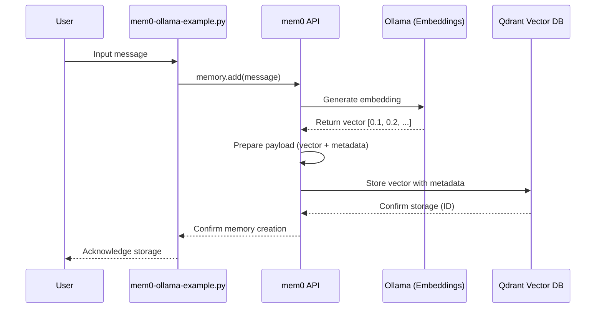
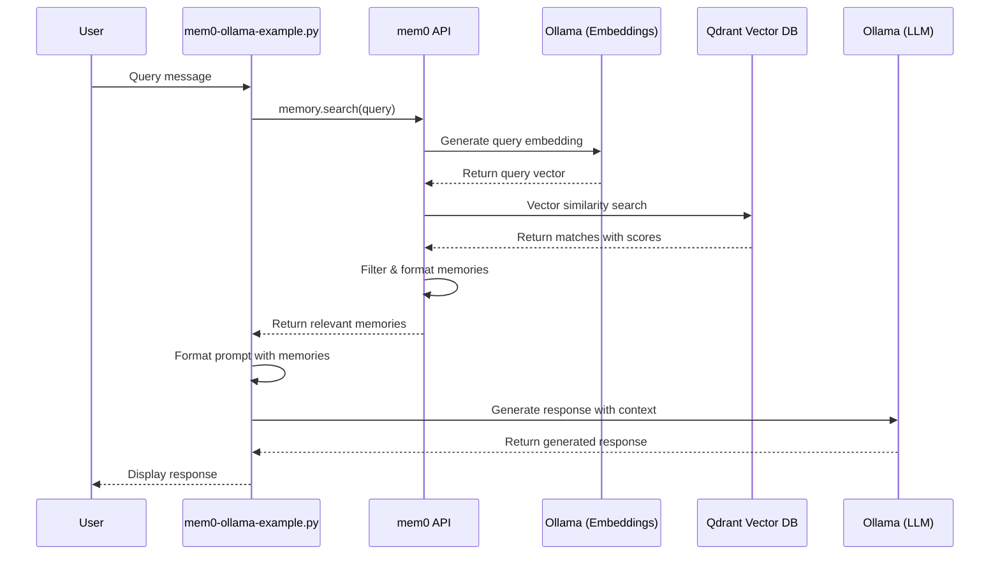

# Advanced Guide: mem0 + Ollama + Qdrant Integration

This document provides a detailed, granular explanation of the integration between mem0, Ollama, and Qdrant, including how each component works, how they interact, and how the custom scripts enable the entire system to function cohesively.

## Table of Contents

1. [System Architecture](#system-architecture)
2. [Component Deep Dive](#component-deep-dive)
3. [Data Flow and Processing](#data-flow-and-processing)
4. [Script Analysis](#script-analysis)
5. [Memory Management](#memory-management)
6. [Vector Storage Internals](#vector-storage-internals)
7. [Embedding Generation](#embedding-generation)
8. [LLM Inference](#llm-inference)
9. [Advanced Configuration](#advanced-configuration)
10. [Performance Considerations](#performance-considerations)
11. [Troubleshooting](#troubleshooting)
12. [Security Considerations](#security-considerations)

## System Architecture

The integration consists of three main components working together in a layered architecture:

```
┌─────────────────────────────────────────────────────────────────┐
│                        Application Layer                         │
│                    (mem0-ollama-example.py)                      │
└───────────────────────────────┬─────────────────────────────────┘
                                │
                                ▼
┌─────────────────────────────────────────────────────────────────┐
│                         Memory Layer                             │
│                         (mem0 API)                               │
└───────────┬─────────────────────────────────────┬───────────────┘
            │                                     │
            ▼                                     ▼
┌───────────────────────┐             ┌───────────────────────────┐
│  Embedding Generation  │             │      LLM Inference        │
│       (Ollama)         │             │        (Ollama)           │
└───────────────────────┘             └───────────────────────────┘
            │                                     │
            └─────────────────┬─────────────────┐│
                              │                 ││
                              ▼                 │▼
                    ┌───────────────────┐       ││
                    │   Vector Storage  │◄──────┘│
                    │      (Qdrant)     │        │
                    └───────────────────┘        │
                              ▲                  │
                              │                  │
                              └──────────────────┘
```

### Processing Sequence

1. **Setup & Initialization:**
   - Docker starts Qdrant container with persistent volume
   - Ollama service is launched (if not already running)
   - mem0 configures connections to both services

2. **Memory Creation:**
   - User input is received by mem0-ollama-example.py
   - Text is sent to Ollama for embedding generation
   - Resulting vector embedding is stored in Qdrant with metadata

3. **Memory Retrieval:**
   - Query text is embedded using Ollama
   - Qdrant performs vector similarity search
   - Results are ranked and filtered by relevance

4. **Response Generation:**
   - Retrieved memories are formatted into context
   - Context + user query are sent to Ollama for LLM inference
   - Response is returned to the user

## Component Deep Dive

### mem0

**Role**: Memory management layer that orchestrates interactions between components.

**Key Functionality**:
- API for memory addition, retrieval, and management
- Vector data organization and metadata handling
- Context formatting for LLM prompting
- User/session isolation mechanisms

**Implementation Details**:
- Uses Python client libraries for Qdrant and Ollama
- Manages collection creation and schema definition
- Handles embedding dimension configuration
- Implements search filtering and post-processing

### Ollama

**Role**: Provides both embedding generation and LLM inference capabilities.

**Key Functionality**:
- Text embedding generation
- LLM-based text completion
- Model management (pulling, loading)
- API for inference parameters

**Implementation Details**:
- REST API on port 11434
- JSON-based request/response format
- Supports streaming responses
- Multiple model support without restarting

### Qdrant

**Role**: Vector database for storing and searching embeddings.

**Key Functionality**:
- Vector storage with metadata
- Approximate nearest neighbor search
- Collection and schema management
- Persistence and backup

**Implementation Details**:
- Runs in Docker container
- Exposes REST API on port 6333
- Uses volume mounting for persistence
- Optimized for high-dimensional vector search

## Data Flow and Processing

### 1. Memory Creation Process



**Detailed Steps**:

1. User message is received by the application
2. Application passes message to mem0's add() method
3. mem0 prepares the text for embedding
4. Text is sent to Ollama's embedding endpoint
5. Ollama model converts text to a high-dimensional vector
6. Vector is returned to mem0 along with calculated dimensions
7. mem0 prepares a storage payload including:
   - The vector embedding
   - Original text as metadata
   - User ID for isolation
   - Timestamp for recency calculation
   - Source information
8. Payload is sent to Qdrant via REST API
9. Qdrant indexes the vector for similarity search
10. Success confirmation is returned through the chain

### 2. Memory Retrieval Process



**Detailed Steps**:

1. User submits a query to the application
2. Application calls mem0's search() method with the query
3. Query text is prepared for embedding
4. Text is sent to Ollama's embedding endpoint
5. Ollama generates a vector representation of the query
6. Vector is sent to Qdrant with search parameters:
   - Number of results to return (limit)
   - Similarity threshold
   - User ID filter (if not using unified memory)
   - Optional additional filters
7. Qdrant performs approximate nearest neighbor search
8. Results are returned with similarity scores
9. mem0 post-processes results:
   - Orders by relevance
   - Formats metadata
   - Applies additional filtering
10. Formatted memories are passed to the application
11. Application builds a prompt including:
    - System instructions
    - Retrieved memories as context
    - User query
12. Complete prompt is sent to Ollama for LLM inference
13. Generated response is returned to the user

## Script Analysis

### mem0-ollama-example.py

**Purpose**: The main application script that provides the user interface and orchestrates interactions.

**Key Components**:

1. **Configuration Handling**:
   ```python
   # Configuration defaults
   OLLAMA_HOST = "http://localhost:11434"
   OLLAMA_MODEL = "llama3"
   QDRANT_HOST = "http://localhost:6333"
   QDRANT_COLLECTION = "ollama_memories"
   
   # Models with their embedding dimensions
   MODEL_DIMENSIONS = {
       "llama3": 4096,
       "mistral": 4096,
       "gemma": 4096,
       "nomic-embed-text": 768,
       "snowflake-arctic-embed": 1024
   }
   ```
   This section defines default configuration for services and a mapping of models to their vector dimensions, which is crucial for proper Qdrant collection configuration.

2. **Health Checking**:
   ```python
   def check_ollama():
       """Check if Ollama is running and has the required model."""
       try:
           response = requests.get(f"{OLLAMA_HOST}/api/tags")
           # Check model availability
           # ...
       except requests.RequestException as e:
           logger.error(f"Error connecting to Ollama: {e}")
           return False
   ```
   The health check functions verify services are running and properly configured before initialization, preventing runtime errors.

3. **Memory Initialization**:
   ```python
   def initialize_memory(
       ollama_model: str = OLLAMA_MODEL,
       embed_model: Optional[str] = None,
       unified_memory: bool = True
   ) -> Memory:
       # Determine embedding dimensions
       embed_dims = MODEL_DIMENSIONS.get(embed_model.split(':')[0], 768)
       
       config = {
           "vector_store": {
               "provider": "qdrant",
               "config": {
                   "collection_name": QDRANT_COLLECTION,
                   "host": QDRANT_HOST.replace("http://", "").split(":")[0],
                   "port": int(QDRANT_HOST.split(":")[-1]),
                   "embedding_model_dims": embed_dims,
                   "unified_memory": unified_memory,
               },
           },
           "llm": {
               "provider": "ollama",
               "config": {
                   "model": ollama_model,
                   "temperature": 0.7,
                   "max_tokens": 2000,
                   "ollama_base_url": OLLAMA_HOST,
               },
           },
           "embedder": {
               "provider": "ollama",
               "config": {
                   "model": embed_model,
                   "ollama_base_url": OLLAMA_HOST,
                   "embedding_dims": embed_dims,
               },
           },
       }
       
       return Memory.from_config(config)
   ```
   This function creates the comprehensive configuration required by mem0, handling different models and their requirements.

4. **Memory Interaction**:
   ```python
   def chat_with_memories(memory: Memory, message: str, user_id: str = "default_user", memory_mode: str = "search"):
       # Memory search
       if memory_mode == "search":
           relevant_memories = memory.search(query=message, user_id=user_id, limit=5)
           # Process and display results
           # ...
       
       # Generate response with context
       system_prompt = f"""You are a helpful AI assistant with memory capabilities.
   Answer the question based on the user's query and relevant memories.

   User Memories:
   {memories_str}
   """
       
       # Create conversation and generate response
       messages = [
           {"role": "system", "content": system_prompt},
           {"role": "user", "content": message}
       ]
       
       assistant_response = memory.chat(messages=messages)
       
       # Store the new interaction as a memory
       if memory_mode != "none":
           memory.add(
               message=message,
               response=assistant_response,
               user_id=user_id
           )
       
       return assistant_response
   ```
   This function handles the core memory search and response generation with appropriate context.

5. **Command Processing**:
   ```python
   def process_command(command: str, memory: Memory, user_id: str, current_mode: str, current_model: str):
       # Command handling logic
       # ...
       if command.startswith("/model"):
           # Model switching code
           # ...
   ```
   Provides runtime command execution for changing modes and models without restarting.

### setup-mem0-integration.ps1 and setup-mem0-integration.sh

These scripts handle the installation and configuration of all required components:

1. **Dependency Detection**:
   Both scripts check for required dependencies (Docker, Python, Ollama) and install any missing components.

2. **Container Management**:
   ```powershell
   # Check if the Qdrant container is already running
   $containerExists = docker ps -a --filter "name=$QdrantContainerName" --format "{{.Names}}"
   if ($containerExists -eq $QdrantContainerName) {
       $containerStatus = docker inspect --format "{{.State.Running}}" $QdrantContainerName
       # Start if not running
       # ...
   } else {
       # Create a Docker volume and start container
       # ...
   }
   ```
   This section manages the Qdrant container creation and ensures persistence.

3. **Model Management**:
   ```powershell
   function Get-OllamaModel {
       param (
           [string]$ModelName
       )
       
       # Check if model exists
       # Pull if missing
       # ...
   }
   ```
   Ensures the required Ollama models are available locally.

4. **Configuration Generation**:
   ```powershell
   # Create docker-compose.yml file if it doesn't exist
   $dockerComposeFile = "docker-compose.yml"
   if (-not (Test-Path $dockerComposeFile)) {
       # Docker compose template generation
       # ...
   }
   ```
   Creates necessary configuration files for service deployment.

## Memory Management

### Memory Storage Structure

Memory in this system is structured as:

1. **Vector Representation**: The high-dimensional embedding representing the semantic content
2. **Metadata**: Structured information about the memory:
   ```json
   {
     "text": "Original memory text",
     "user_id": "user123",
     "timestamp": 1648763389,
     "type": "conversation",
     "role": "user"
   }
   ```
3. **Payload**: The combined storage object:
   ```json
   {
     "id": "unique-memory-id",
     "vector": [0.1, 0.2, ..., 0.768],
     "payload": {
       "text": "Original memory text",
       "user_id": "user123",
       "timestamp": 1648763389,
       "type": "conversation",
       "role": "user"
     }
   }
   ```

### Memory Isolation Models

The integration supports multiple memory isolation models:

1. **Unified Memory** (`unified_memory: true`):
   - All models share the same vector collection
   - All users can access all memories
   - Most versatile but least isolated

2. **User-isolated Memory** (`memory.search(..., user_id="user123")`):
   - Memories are filtered by user_id
   - Different users can't access each other's memories
   - Same collection but filtered access

3. **Model-isolated Memory** (`unified_memory: false`):
   - Creates separate collections for different embedding models
   - Necessary when using models with different vector dimensions
   - Prevents cross-model contamination

4. **Session-isolated Memory** (via application logic):
   - Memories are associated with specific sessions
   - Short-term context without long-term storage
   - Implemented at the application level

## Vector Storage Internals

### Qdrant Collection Schema

The Qdrant collection is configured with specific parameters based on the embedding model:

```json
{
  "name": "ollama_memories",
  "vectors": {
    "size": 768,
    "distance": "Cosine"
  },
  "shard_number": 1,
  "replication_factor": 1,
  "on_disk_payload": true,
  "hnsw_config": {
    "m": 16,
    "ef_construct": 100,
    "full_scan_threshold": 10000
  }
}
```

Key parameters:
- `size`: Vector dimensions (varies by model, e.g., 768 for nomic-embed-text)
- `distance`: Cosine similarity for semantic matching
- `on_disk_payload`: Persistence configuration
- `hnsw_config`: Hierarchical Navigable Small World graph parameters for search efficiency

### Search Parameters

When searching for memories, these parameters affect results:

```json
{
  "vector": [0.1, 0.2, ...],
  "limit": 5,
  "filter": {
    "must": [
      {
        "key": "user_id",
        "match": {
          "value": "user123"
        }
      }
    ]
  },
  "with_payload": true,
  "with_vectors": false
}
```

Key parameters:
- `limit`: Maximum number of results to return
- `filter`: Metadata-based filtering criteria
- `with_payload`: Include the memory text and metadata
- `with_vectors`: Whether to return the actual vectors (usually not needed)

## Embedding Generation

### Ollama Embedding API

The embedding generation uses Ollama's API:

```python
def ollama_embed(text, model="nomic-embed-text"):
    url = f"{OLLAMA_HOST}/api/embeddings"
    payload = {
        "model": model,
        "prompt": text
    }
    response = requests.post(url, json=payload)
    if response.status_code == 200:
        return response.json().get("embedding", [])
    else:
        print(f"Error generating embedding: {response.status_code}")
        print(response.text)
        return []
```

This produces a vector of floating-point values representing the text's semantic meaning. The vector dimensions depend on the model used.

### Model Selection Strategy

The implementation uses a smart model selection strategy:

1. First, check for dedicated embedding models (optimized for vector representation):
   - nomic-embed-text (768 dimensions)
   - snowflake-arctic-embed (1024 dimensions)

2. If specialized models aren't available, fall back to the LLM model:
   - LLaMA models (4096 dimensions)
   - Other models with default fallback (768 dimensions)

This approach balances performance and quality, using specialized embedding models when available.

## LLM Inference

### Ollama Inference API

LLM-based chat responses are generated using Ollama's API:

```python
def ollama_generate(prompt, system="You are a helpful assistant.", model=OLLAMA_MODEL):
    url = f"{OLLAMA_HOST}/api/generate"
    payload = {
        "model": model,
        "prompt": prompt,
        "system": system,
        "stream": False
    }
    response = requests.post(url, json=payload)
    if response.status_code == 200:
        return response.json().get("response", "")
    else:
        print(f"Error: {response.status_code}")
        print(response.text)
        return "Error generating response"
```

Key parameters:
- `model`: The Ollama model to use for generation
- `prompt`: The user's query
- `system`: System instructions including memory context
- `stream`: Whether to stream tokens (disabled for simplicity)

### Context Construction

The context for LLM inference is constructed as:

```
You are a helpful AI assistant with memory capabilities.
Answer the question based on the user's query and relevant memories.

User Memories:
- I visited Paris last summer
- I enjoy French cuisine
- My favorite monument is the Eiffel Tower

<user query text>
```

This format effectively primes the model with relevant memory information before answering the query.

## Advanced Configuration

### Customizing Collection Settings

You can configure Qdrant collection parameters in the Memory initialization:

```python
config = {
    "vector_store": {
        "provider": "qdrant",
        "config": {
            # Basic configuration
            "collection_name": "custom_collection",
            "host": "localhost",
            "port": 6333,
            "embedding_model_dims": 768,
            
            # Advanced configuration
            "distance": "Cosine",  # Or "Euclid", "Dot"
            "shard_number": 1,
            "replication_factor": 1,
            "write_consistency_factor": 1,
            "on_disk": True,
            "hnsw_config": {
                "m": 16,
                "ef_construct": 100,
                "full_scan_threshold": 10000
            }
        }
    }
}
```

### Fine-tuning LLM Parameters

Adjust LLM generation parameters for different response characteristics:

```python
config = {
    "llm": {
        "provider": "ollama",
        "config": {
            "model": "llama3",
            # Generation parameters
            "temperature": 0.7,      # Higher = more creative, lower = more deterministic
            "top_p": 0.9,            # Nucleus sampling parameter
            "max_tokens": 2000,      # Maximum output length
            "presence_penalty": 0.0,  # Reduce repetition
            "frequency_penalty": 0.0, # Reduce repetition of tokens
            "stop": ["###"],         # Stop sequences
            
            # System configuration
            "ollama_base_url": "http://localhost:11434",
        }
    }
}
```

### Customizing Memory Search

The search behavior can be customized with additional parameters:

```python
results = memory.search(
    query="What did I do last summer?",
    user_id="user123",
    limit=5,                     # Number of results to return
    min_relevance_score=0.75,    # Minimum similarity threshold (0-1)
    filter={                     # Additional metadata filters
        "must": [
            {"key": "timestamp", "range": {"gte": 1625097600}}  # After July 1, 2021
        ]
    },
    include_vectors=False        # Don't return raw vectors
)
```

## Performance Considerations

### Vector Dimensions and Search Speed

The choice of embedding model affects both quality and performance:

| Model | Dimensions | Memory Usage | Search Speed | Quality |
|-------|------------|--------------|--------------|---------|
| nomic-embed-text | 768 | Low | Fast | Good |
| snowflake-arctic-embed | 1024 | Medium | Medium | Very Good |
| LLaMA models | 4096 | High | Slow | Good |

Higher dimensions provide more semantic information but require more storage and slower search. Consider your requirements when selecting models.

### Batch Processing

For adding multiple memories efficiently, use batch operations:

```python
# Instead of:
for message in messages:
    memory.add(message, user_id="user123")

# Use batch operations:
memory.add_batch([
    {"text": "Memory 1", "user_id": "user123"},
    {"text": "Memory 2", "user_id": "user123"},
    {"text": "Memory 3", "user_id": "user123"}
])
```

This reduces network overhead and improves performance for bulk operations.

### Caching Strategies

For frequently accessed memories, consider implementing application-level caching:

```python
# Simple memory cache
memory_cache = {}

def get_memories_with_cache(query, user_id):
    cache_key = f"{user_id}:{query}"
    if cache_key in memory_cache:
        return memory_cache[cache_key]
    
    results = memory.search(query=query, user_id=user_id)
    memory_cache[cache_key] = results
    return results
```

## Troubleshooting

### Common Issues

1. **Vector Dimension Mismatch**
   - **Symptom**: Error when adding memories: "Vector dimensions do not match collection schema"
   - **Solution**: Ensure embedding_model_dims matches the actual model output dimensions

2. **Qdrant Connection Failures**
   - **Symptom**: "Could not connect to Qdrant" errors
   - **Solution**: Verify Docker container is running and ports are properly mapped

3. **Ollama Model Not Found**
   - **Symptom**: "Model X not found" errors
   - **Solution**: Run `ollama pull modelname` to download the required model

4. **Memory Not Found**
   - **Symptom**: Search returns no results despite adding memories
   - **Solution**: Check user_id consistency and unified_memory setting

### Debugging Techniques

1. **Enable Debug Logging**:
   ```python
   import logging
   logging.basicConfig(level=logging.DEBUG)
   ```

2. **Inspect Qdrant Collections**:
   Access the Qdrant UI at http://localhost:6333/dashboard to inspect collections and settings.

3. **Test Ollama Directly**:
   ```bash
   curl -X POST http://localhost:11434/api/embeddings -d '{
     "model": "nomic-embed-text",
     "prompt": "Test embedding"
   }'
   ```

4. **Verify Embedding Dimensions**:
   ```python
   embed = ollama_embed("Test text", model="your-model")
   print(f"Model produces vectors with {len(embed)} dimensions")
   ```

## Security Considerations

### Data Protection

1. **Memory Isolation**:
   - Use user_id filtering to prevent unauthorized access to memories
   - Consider encrypting sensitive memory content before storage

2. **API Security**:
   - Ollama and Qdrant have no built-in authentication
   - Run them on localhost or secure networks only
   - Consider setting up reverse proxies with authentication for production

3. **Docker Volume Security**:
   - Qdrant stores data in the mounted volume
   - Ensure proper filesystem permissions

### User Privacy

1. **Data Minimization**:
   - Store only necessary information in memories
   - Implement memory expiration for non-essential data

2. **Memory Management**:
   - Provide memory deletion functionality:
     ```python
     memory.delete(memory_id="specific-memory-id", user_id="user123")
     # Or delete all user memories:
     memory.delete_all(user_id="user123")
     ```

3. **Transparency**:
   - Make users aware of stored memories
   - Provide functionality to view and manage their memories
